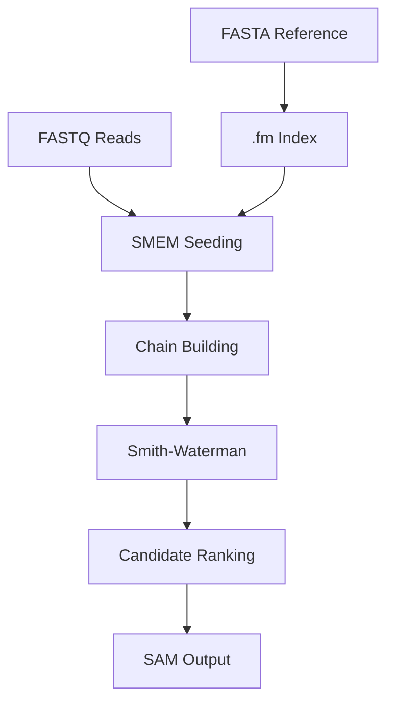

# Architecture Overview

bwa-rust maintains a small, clear single-end alignment pipeline:

## Module Boundaries

| Module | Responsibility |
|--------|----------------|
| `src/io/fasta.rs` | Read and normalize reference sequences. |
| `src/io/fastq.rs` | Read reads, validate seq/qual. |
| `src/index/` | Build SA, BWT, FM-index and serialize `.fm`. |
| `src/align/seed.rs` | Find SMEM/MEM seeds via FM-index lookup. |
| `src/align/chain.rs` | Chain building, weak chain filtering, candidate count control. |
| `src/align/extend.rs` + `sw.rs` | Chain-end extension, intra-chain gap filling, CIGAR/NM/score. |
| `src/align/pipeline.rs` | Forward/reverse candidates, sorting, MAPQ, SAM record generation. |
| `src/io/sam.rs` | SAM header/record/MD:Z/SA:Z formatting. |

## Design Trade-offs

- Index format is incompatible with BWA, using single-file `.fm` instead.
- SA construction uses a clear doubling algorithm, not pursuing optimal O(n) build speed.
- MAPQ and heuristics are BWA-MEM style, not guaranteed to match BWA exactly.
- Only single-end reads are promised; paired-end infrastructure does not represent delivered CLI capability.

## Continue Reading

- [Core Algorithms](/en/architecture/algorithms)
- [Alignment Pipeline](/en/architecture/pipeline)
